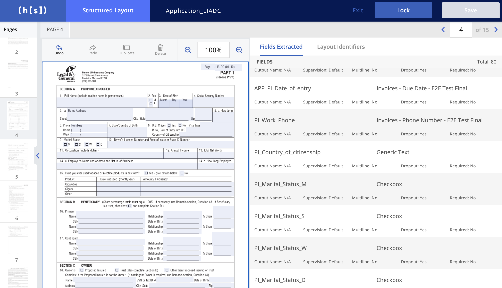
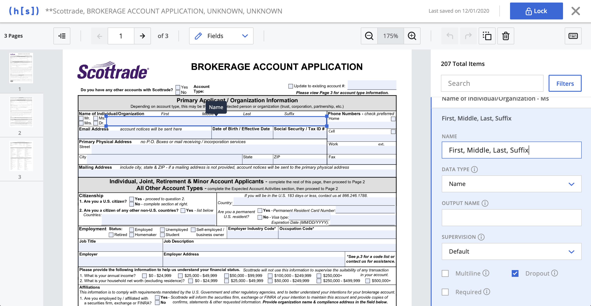

## Project Background

The Hyperscience platform helps enterprise customers automate data entry of paper forms. We use machine learning models to automatically classify documents and extract handwriting and printed text from them, then output the extracted text as structured JSON to a downstream system. Common use cases include extracting text from health insurance claims, mortgage applications, invoices, or paystubs. Our customers use Hyperscience because it can drastically reduce the amount of manual work that’s required to process a paper document or form.

## What is a layout and why is it important?

When a user wants Hyperscience to extract data from a specific form, they must first create a layout in the system. Layouts help guide the transcription models and train the machine how to identify a form and which fields to extract from it. When a layout is not configured properly or is missing all-together, it can severely reduce the automation rates for our customers. They don’t like that. 

To configure a layout, users must upload a blank version of the form and draw bounding boxes around all of the fields they need to extract – this might include text fields, dates, checkboxes, signatures, and more.

Here’s a hypothetical example of a completed layout for an insurance application form. In this case an insurance underwriter is our primary user, she would have gone into Hyperscience to upload a blank version of the insurance form and then drawn bounding boxes to label all of the fields she needed to extract. You can see that each field has a few settings that can be configured here as well - these settings help the machine do its job but we won’t discuss them all here.

## The Problem with Layouts

Layouts are critical to the automation process, but we heard from customers that creating and configuring them was tedious, frustrating, and error prone. 

We identified the following pain pain points:

###As a layout owner, drawing fields to create a new layout took too much time and was easy to mess up.###

   * Most layouts are multiple pages and have hundreds or even thousands of fields that often look really similar. For example, a form might have 10 checkboxes in a row. Users had to draw and properly label all 10 of those checkboxes.
   * Checkboxes saw the largest drop in automation when users didn’t draw them properly around the checkbox outline.
   * The layout editor design required users to awkwardly pan and zoom around the document in a small portion of the screen to draw fields effectively. 

###As a Layout owner, making changes to an existing layout was frustrating.###
   * Users often returned to the layout editor to modify field configurations while optimizing a layout. For example, they may adjust the format of a date field or mark a certain field as Required. Unfortunately, there was no easy way to search for specific fields by name or type. Users had to hunt for the specific field they wanted on each page of the layout.
   * Additionally, we found that users tend to make the same changes over and over again when optimizing layouts – if they were changing the data format for one field, they usually needed to change it for all similar fields.

###As a layout owner, I want to create a new layout, but I don’t have a high quality blank version of the form to start with.###
   * We discovered that our users often didn’t have an ideal “blank” document image to create a new layout – they sometimes only had a series of completed forms that they needed to extract data from. 

## Our solution

###Creating new layouts and drawing fields###
   * To make this experience a bit easier, we first redistributed the core elements on the page to give more space to the document editing canvas. This meant users wouldn’t have to pan and zoom as much when drawing lots of fields. We also Introduced a new streamlined toolbar design to help give more space to the document editing experience. 
   * We also added two new beta features to help speed up drawing repetitive fields and increase accuracy called Auto Clone and One-click mode.
   * Auto Clone allowed a user to draw and label one field then magically find all other fields on the page that looked similar and instantly create them. This was especially useful when labeling forms with lots of checkboxes
   * One-click mode was a setting that allowed users to click anywhere within a blank field and have the system automatically identify and draw the bounding box for you. This meant perfectly drawn bounding boxes every time.  

###Editing layouts###
   * To help users edit and optimize layouts, we added the ability to bulk edit fields and redesigned the sidebar to make room for a new field search and filters. When used together, users could now quickly search for any instance of a field across all document pages, select them all and bulk edit their configurations with just a few clicks.

###Creating missing layouts###
   * To help business process managers create new layouts from poor quality document images, we introduced a new image editing experience at the beginning of the flow. Users no longer needed a high quality blank document to get started – they could simply upload any completed document then adjust, crop, and erase any previous text from the image. This gave users the power to edit images right from within the layout creation flow.

## Validation and Launch

We worked closely with our customer success team, solutions engineers, and end users to gather feedback, test, and iterate on these features throughout the design and dev cycle. 

We also took a beta version of the new experience to one of our customers to demo. They were so excited about the new field search and bulk editing features. Because of that, we added some additional searching and filtering options to help fine tune this feature before launch.

## Outcome

Later in the year we rolled out the new experience to all customers with a 85% adoption rate and positive reviews. The improved layout editing experience was specifically called out by a new customer in a deal worth $1M+ ARR.
