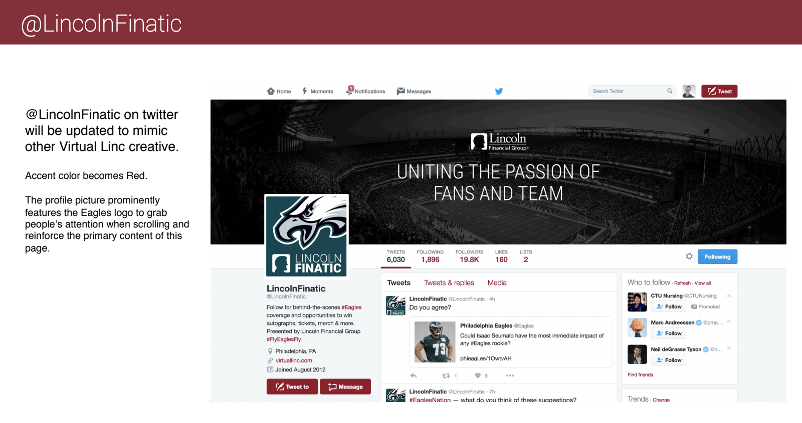

Lincoln Financial Group was looking for a way to extend their partnership with the Philadelphia Eagles beyond the naming rights of Lincoln Financial Field (’The Linc’). We worked to create a new digital campaign called The Game Plan that leveraged four main tactics: A four-part documentary series, a digital microsite called "The Virtual Linc”, an always-on social channel, and an animated explainer series called “The Financial Playbook”.

## The Identity
The visual identity for this campaign had to appeal to excited Eagles fans while also aligning with Lincoln Financial’s brand story. I developed a versatile logo, color scheme, and illustration set along with photography and copy guidance. We developed assets for TV, web, In-Stadium and print. The brand identity had to be approved by Lincoln Financial Group, The Eagles, and the NFL.

## The Virtual Linc™ Microsite
The Virtual Linc was a socially powered application that gave Eagles fans a chance to win prizes every week during the season. Participants could take on the weekly challenge featuring Eagles trivia, post photos of their greatest eagles moments with loved ones, and much more. I designed the microsite and worked with our team of engineers to develop it in time for the season kickoff.

##The Video Series
This miniseries followed four Eagles players at critical points in their career, highlighting challenges and successes they’re experiencing both on and off the field. We released each video on social media throughout the NFL season.

<iframe src="https://www.facebook.com/plugins/video.php?height=314&href=https%3A%2F%2Fwww.facebook.com%2Fphiladelphiaeagles%2Fvideos%2F1508438149193953%2F&show_text=true&width=560" width="560" height="429" style="border:none;overflow:hidden" scrolling="no" frameborder="0" allowfullscreen="true" allow="autoplay; clipboard-write; encrypted-media; picture-in-picture; web-share" allowFullScreen="true"></iframe>

##Financial Playbook
This financial educational series played out as weekly animated shorts on our social media accounts. I designed each of the animations.
  
