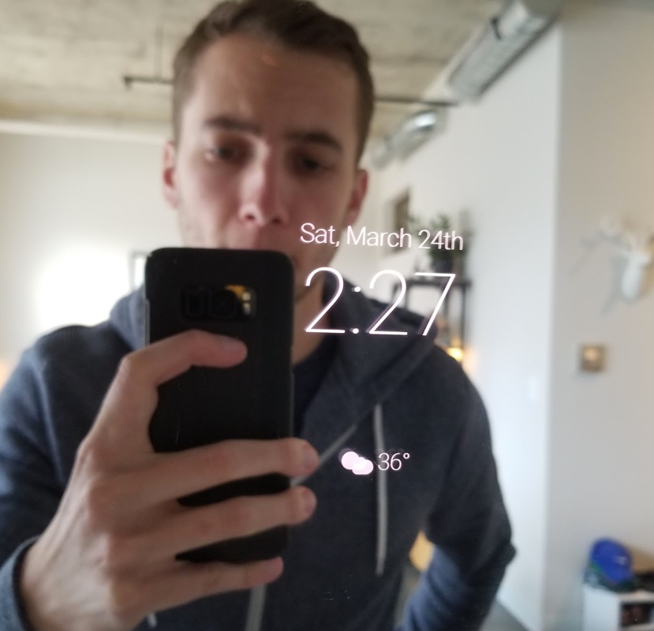
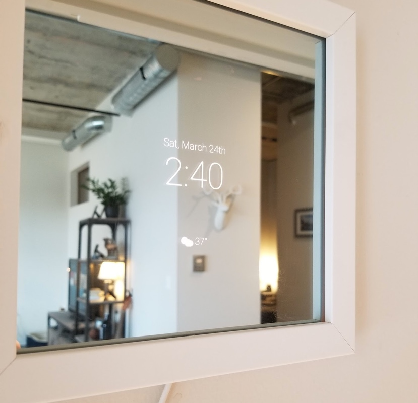
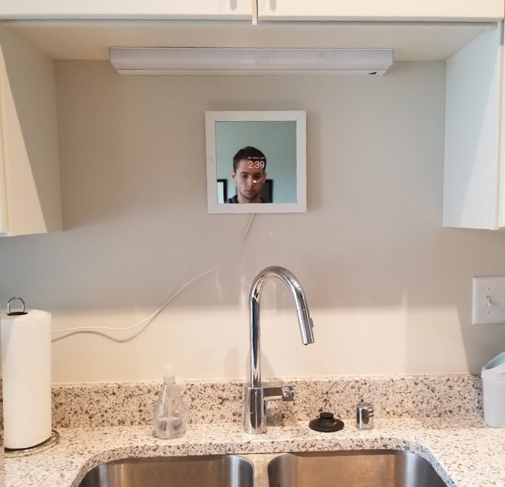
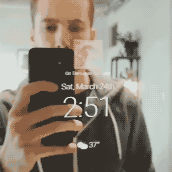

Smart mirrors have been a fascination for me for a long time – there’s plenty of super cool examples on the internet of touch mirrors, or voice controlled mirrors or TVs running in mirrors. This stuff got me really excited about the technology but in most cases the technology still felt forced. I set out to build my own smart mirror and rethink the user experience. I built a smart mirror prototype in order to help understand how I’d want to use it.

After a few iterations of my mirror, I started to realize that the hardware needed to build a smart mirror was pretty easy to acquire and assemble – it was easy to get up an running in just a few days. I decided to refocus my project on building a flexible user interface that can power any smart mirror.

### A few key principles

* Mirrors are personal – People use mirrors to check themselves out. My mirror should enhance this experience.
* Mirrors are passive – People don’t talk to mirrors or touch mirrors. My mirror should blend into its surroundings when not being used.
* Mirrors are usually in public spaces – My mirror needs to know who is using it since most mirrors are shared.
* Mirrors come in a variety of styes –  My mirror needs to be able to work on any shape or size of mirror.

###Personal Use – Facial Recognition
I mounted a camera behind the glass to capture a frame once per second. The app scans each image to detect the amount of change between them. Once a certain threshold of motion is detected, the image is analyzed using the Kairos API to distinguish any faces within the frame. All of this comes together to give the mirror the magical ability to know who you are as soon as the you walk up to it. With this information the mirror can show you personalized news or traffic updates. Each user is logged out as soon as they walk away.

<figure class="content work one super_compressed_width">
    

        <iframe width="560" height="315" src="https://www.youtube.com/embed/-vpdDDPfPnU?rel=0&amp;showinfo=0" frameborder="0" allow="autoplay; encrypted-media" allowfullscreen></iframe>
    

</figure>

###Passive Use
The mirror always displays the current weather, date and time. I’ve also connected the mirror to Spotify so that it displays the album artwork and song title for any song that’s being played. This is especially useful when playing music via my Google Home.

###What's Next
I am working on a larger version of my smart mirror prototype next and plan to expand on the facial recognition functionality – giving more customized experience to each individual user who walks up to the mirror.