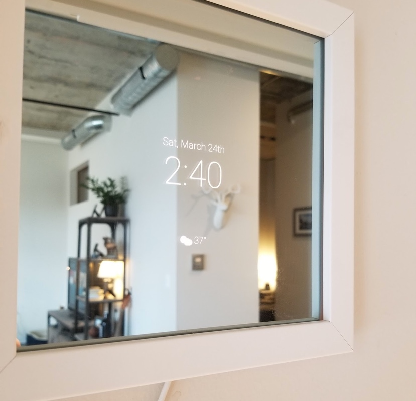
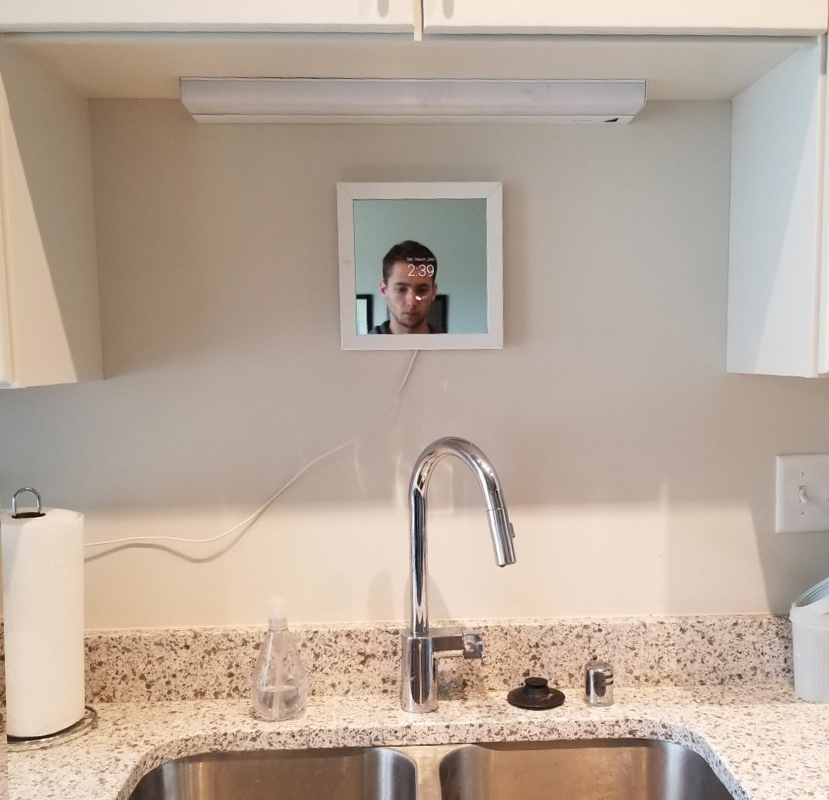
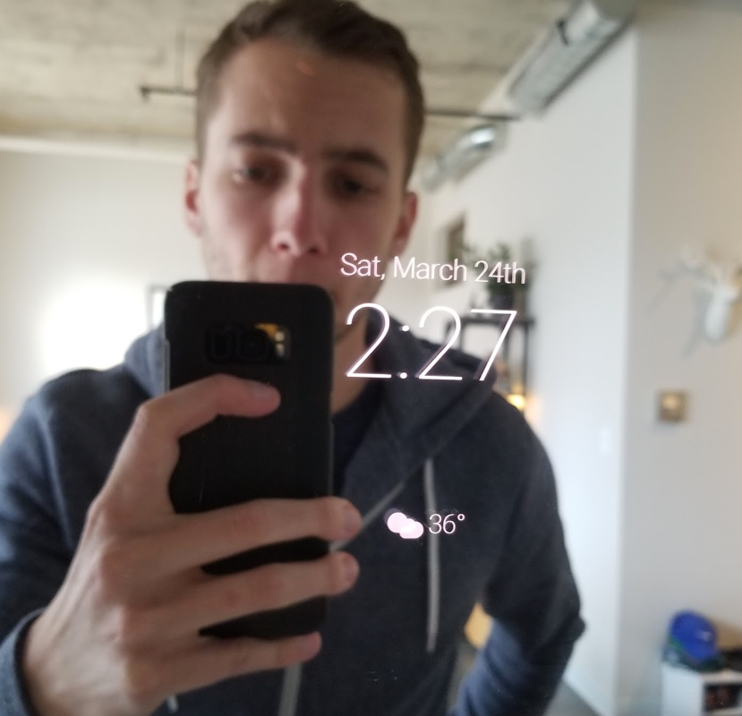
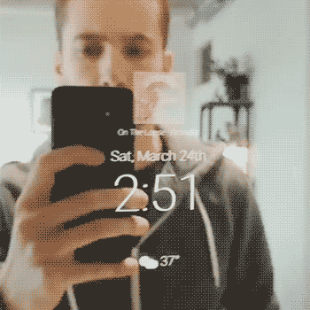

I’ve been seeing lots of cool smart mirror projects and prototypes online over the past few years. I was surprised to find out that building the mirror itself was actually not too difficult and I started getting really excited about the software side of things. Many of the prototypes I saw online had really clunky experiences so I set out to build my own smart mirror and rethink the user experience.

I bought a small 12” x 12” sample of mirrored glass, a basic white frame, and mounted an old Android phone behind it. I began testing out different visualizations for the date, time, and weather with static designs I created in Figma. I played around with how notifications might appear and listing long bits of text like a twitter feed. These static prototypes helped me realize that less is really more when it comes to a smart mirror. I paired down the most basic information I wanted to display to just the date, time, and weather. 

### Building the prototype 

I built the functional prototype with some simple HTML, CSS, and Javascript over a couple weekends. I mounted it right above my kitchen sink and iterated on the initial concept over a month or so. I loved it! It was sleek and functional. I found myself glancing over at it often in passing and it became a fun discussion topic when friends would come over. I was really happy with the prototype I had built but it was basically just a fancy clock at that point. I wanted to push the limits of the design.

###Building a more personalized experience
I started thinking about how I might make my smart mirror more personalized. Maybe it could show my calendar, or to-do list, or news feed? This was a challenge, because I didn’t want my personalized content to be displayed on the mirror all the time since the mirror was mounted in my kitchen. I needed a way to trigger a personalized experience only when the mirror was actively used. I thought about touch or voice interactions but both had drawbacks. Touching the mirror would just create smudges, and talking to the mirror felt unnatural to me. I wanted it to just know who I was as soon as I walked up to it – and cater the experience to me. I needed facial recognition.

###Experimenting with computer vision and facial recognition
I started experimenting with the <a href="https://www.kairos.com/" target="_blank">Kairos API</a> to handle facial recognition. I used the API to train a model to identify me from an image I submitted. After lots of trial and error, I got it to reliably recognize me in many settings (day, night, close up, far away, wearing glasses, etc.). But I was still just submitting test images through the API. The next challenge was integrating this into my mirror’s software.

Since I was using an old phone as the mirror’s display behind the glass, I already had access to a camera mounted behind the glass too. I spent a weekend playing around with the mount in order to get the camera to reliably see through the mirrored glass. Next, I needed a way to trigger the camera and post the image to the facial recognition API. I didn’t want the app to be constantly streaming video of my home from the mirror, instead, I wanted it to only attempt to recognize a face when there was significant motion detected in front of it. I wrote a simple javascript app that captured one frame per second from the mirror’s camera. It compared pixels from that image to it’s previous image and looked for changes between the two images. If more than 15% of the pixels had changed, the app posted the image to the facial recognition API and returned a result within about 1 second. This meant that when a user walked up to the mirror, it would first detect their motion, then look for a face in the image and if it recognized it, would return the name of the user.

Getting this timing down took a ton of trial and error. I also had to experiment with different loading states during the 1 second of processing so a user noticed that the mirror recognized them in the first place. I designed the mirror to give a response even when it detected a face that it didn’t know – basically a more generic experience and I experimented with interactions to log the user out, settling on a simple 10 second timeout after the user walked away.

<figure class="content work one super_compressed_width">
    

        <iframe width="560" height="315" src="https://www.youtube.com/embed/-vpdDDPfPnU?rel=0&amp;showinfo=0" frameborder="0" allow="autoplay; encrypted-media" allowfullscreen></iframe>
    

</figure>

###“It’s like magic”
Once I remounted the smart mirror and started playing around with it, the whole experience felt like magic. At this point, the mirror could recognize me and simply say “Hello, Josh!” – it wasn’t even displaying anything that exciting but it was so cool how fluid the experience felt to just walk up to it and have it respond to you. I trained it to recognize a few of my friends and invited them over to see what they thought. It was so fun!

###What's Next
I am working on a larger version of my smart mirror prototype next and plan to expand on the facial recognition functionality – giving more customized experiences to each user who walks up to the mirror. I’m also exploring more details to display in the mirror like a Spotify Now Playing widget.